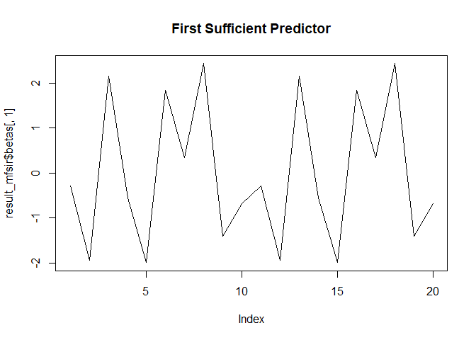

<!-- README.md is generated from README.Rmd. Please edit that file -->

\#fquantdr

<!-- badges: start -->
<!-- [](https://travis-ci.com/elianachristou/fquantdr) -->
<!-- badges: end -->

fquantdr: Dimension Reduction Techniques for Conditional Quantiles for
Functional Data
====================================================================

The R package `fquantdr` performs dimension reduction techniques for
conditional quantiles of a scalar response given the functional
predictors. Specifically, the method aims at replacing the
infinite-dimensional functional predictors with a few finite predictors
without losing important information on the conditional quantiles while
maintaining a flexible nonparametric model. For details of the
methodology, see Christou et al. (2024).
<!-- [Christou, E., Solea, E., Wang, S., and Song, J. (2024+) Sufficient Dimension Reduction for Conditional Quantiles for Functional Data. *Journal*, volume, pages](link) -->

The main function of the package is `fcqs`, which estimates the
directions of the functional central quantile subspace. However, the
package includes more functions that are helpful to run `fcqs`.
Specifically, `mfsir` performs functional sliced inverse regression
(FSIR) of [Ferre and Yao
(2003)](https://doi.org/10.1080/0233188031000112845) and `sonf` performs
scalar-on-function linear regression. Moreover, `fundata` generates
functional data and `mcorr` computes the multiple correlation between
two vector or matrices.

## Installation

<!-- You can install the stable version of fquantdr from CRAN with: -->

``` r
# To install the package
install.packages("fquantdr")

# To install the development version from GitHub, you can use:
# Ensure the devtools package installed
# install.packages("devtools")

# Then, install the development version of fquantdr
devtools::install_github("elianachristou/fquantdr")
```

## Example

This is a basic example which shows you how to solve a common problem
using ‘mfsir’:

``` r
library(fquantdr)

# Example data
set.seed(123)
X <- array(rnorm(1000), dim = c(100, 10, 2))  # 100 observations, 10 time points, 2 predictors
y <- rnorm(100)  # response variable
H <- 5  # number of slices
nbasis <- 10  # number of basis functions

# Running the FSIR function
result_mfsir <- mfsir(X, y, H, nbasis)
print(result_mfsir$phi)  # eigenvectors
#>               [,1]        [,2]        [,3]        [,4]        [,5]         [,6]
#>  [1,]  0.093271998  0.30597319 -0.06575054  0.12810563  0.26598042  0.072484855
#>  [2,]  0.033992109 -0.11340719 -0.27388461  0.06306464  0.12626460  0.147536172
#>  [3,] -0.039077480 -0.51703577  0.13593528  0.32582304 -0.02651821 -0.034382377
#>  [4,]  0.183390709  0.26339690 -0.14566376  0.37342263 -0.20069802 -0.005230491
#>  [5,] -0.008579697  0.01318443 -0.03083047 -0.36796107 -0.16568654  0.179065910
#>  [6,]  0.003172854 -0.08862111 -0.30159110 -0.18137231 -0.26401292 -0.006788095
#>  [7,] -0.287475087  0.18048724  0.35949069  0.05691148 -0.31600746  0.130239183
#>  [8,]  0.478010616 -0.03706179  0.36357013 -0.18624992  0.14184487  0.097729328
#>  [9,] -0.090679808 -0.08764782 -0.13695767 -0.15889174  0.17585135 -0.478606529
#> [10,] -0.368161770  0.08459557  0.09426477 -0.05040721  0.21578567 -0.138573769
#> [11,]  0.093271998  0.30597319 -0.06575054  0.12810563  0.33418966 -0.239589108
#> [12,]  0.033992109 -0.11340719 -0.27388461  0.06306464  0.15899927  0.426835213
#> [13,] -0.039077480 -0.51703577  0.13593528  0.32582304  0.01120068 -0.075287359
#> [14,]  0.183390709  0.26339690 -0.14566376  0.37342263 -0.23078141 -0.128607780
#> [15,] -0.008579697  0.01318443 -0.03083047 -0.36796107 -0.13436570 -0.014262685
#> [16,]  0.003172854 -0.08862111 -0.30159110 -0.18137231 -0.37469406 -0.038784418
#> [17,] -0.287475087  0.18048724  0.35949069  0.05691148 -0.26404490 -0.203542261
#> [18,]  0.478010616 -0.03706179  0.36357013 -0.18624992  0.03446811 -0.073074064
#> [19,] -0.090679808 -0.08764782 -0.13695767 -0.15889174  0.20971742 -0.436803805
#> [20,] -0.368161770  0.08459557  0.09426477 -0.05040721  0.33766572  0.404728052
#>               [,7]         [,8]         [,9]        [,10]       [,11]
#>  [1,]  0.016532590  0.320373769  0.076509074 -0.407378221  0.00000000
#>  [2,] -0.215206016 -0.143853020 -0.149376652 -0.126181086 -0.02579833
#>  [3,] -0.049372264 -0.073116768  0.200137995  0.123238583  0.45513005
#>  [4,]  0.013089126 -0.009043157 -0.232826594  0.080977057 -0.08609137
#>  [5,]  0.111221227  0.380753453  0.252283065  0.010884491  0.01318281
#>  [6,] -0.125885095  0.116125238 -0.004155748 -0.461095602  0.22791438
#>  [7,] -0.040579048 -0.330216945  0.446304283 -0.250379682 -0.27814792
#>  [8,] -0.209745169 -0.113622116 -0.264810846 -0.004632029 -0.24956484
#>  [9,] -0.222517118  0.308180158  0.319534393 -0.031381773 -0.28727881
#> [10,] -0.022079043 -0.002134408 -0.447385055 -0.136844165 -0.06493449
#> [11,] -0.058378849 -0.072147442  0.293810232  0.330716150 -0.10167256
#> [12,] -0.580489037  0.095242487  0.131573851  0.162163753 -0.02434372
#> [13,] -0.032959916  0.156160877 -0.011479258 -0.150391646 -0.53065667
#> [14,] -0.196726931 -0.120618503  0.183687298 -0.046002125  0.04435925
#> [15,] -0.417826432 -0.399178781 -0.001480533 -0.038821952 -0.08897654
#> [16,]  0.170556218  0.034527887 -0.071845388  0.485805590 -0.27981140
#> [17,] -0.489362338  0.369106457 -0.224719795  0.222357334  0.20389235
#> [18,] -0.004732219  0.111329602  0.182399018  0.040345618  0.20303486
#> [19,] -0.018005541 -0.364036797  0.028204581 -0.033354467  0.20258655
#> [20,]  0.057375403 -0.030726598  0.122885491  0.226107699  0.04152297
#>               [,12]         [,13]       [,14]       [,15]       [,16]
#>  [1,]  0.3212280841  0.0000000000 -0.25891057 -0.37633746  0.27088575
#>  [2,]  0.0119281915  0.6224105850  0.25137935 -0.16326076 -0.02448903
#>  [3,]  0.1046146615 -0.0401773170  0.31915243 -0.19065140  0.28644610
#>  [4,]  0.0221020343  0.1639346357  0.06036635  0.24518726  0.61200560
#>  [5,]  0.4314401389  0.0729093016  0.27797345  0.12249328 -0.03242807
#>  [6,] -0.0818087544  0.1492362241  0.17393582  0.29001896 -0.02446351
#>  [7,]  0.1336515478  0.0008541363  0.14498053  0.09590910  0.18357330
#>  [8,]  0.2503374653 -0.0856484197  0.38810687 -0.20930602 -0.02612349
#>  [9,] -0.2838436366  0.0240552079  0.21806875 -0.19534881  0.18086866
#> [10,]  0.1002824656 -0.0463890213  0.28744866  0.35535369 -0.03981824
#> [11,]  0.0003028289  0.0599746530  0.23232364  0.28269243 -0.02069012
#> [12,]  0.1328738874 -0.3522292806 -0.11810986  0.29842801  0.04106708
#> [13,]  0.1470437449  0.1903068408 -0.28098372  0.19562659 -0.12888738
#> [14,]  0.1366950209  0.0999453411  0.06174990 -0.11405559 -0.57346059
#> [15,] -0.1742453858  0.0566545819 -0.25489056 -0.14490807  0.19369130
#> [16,]  0.2469277854  0.1238995737 -0.04526951 -0.14054250  0.07166582
#> [17,]  0.1093775566  0.1401186470 -0.11008942 -0.10303120 -0.03259262
#> [18,] -0.0985420977  0.3690194174 -0.24978332  0.36378596  0.05420989
#> [19,]  0.5912691929  0.0401072158 -0.24143349  0.09905337  0.05920235
#> [20,] -0.0260362287  0.4434139140 -0.06642504 -0.07014434 -0.03669550
#>             [,17]       [,18]       [,19]       [,20]
#>  [1,]  0.24322032 -0.17462208  0.22600438 -0.01629297
#>  [2,] -0.20536263 -0.41452222 -0.21156913 -0.16318475
#>  [3,]  0.22685225 -0.06406553  0.14852145  0.15495657
#>  [4,] -0.07712921  0.29447891 -0.17459982  0.19688447
#>  [5,] -0.21543919 -0.07817298 -0.13697671  0.47596034
#>  [6,]  0.04880051  0.31000395  0.46008246 -0.22481914
#>  [7,]  0.03965469 -0.10215414 -0.08141994 -0.29178013
#>  [8,] -0.00180657  0.30156264  0.12187293 -0.11549005
#>  [9,]  0.12557988  0.21832220 -0.29115140 -0.04711256
#> [10,]  0.51105397 -0.19940867 -0.07252996  0.16619814
#> [11,] -0.17431388 -0.21328013  0.52805812  0.02406379
#> [12,]  0.10285120 -0.02431252 -0.16213953 -0.15940191
#> [13,] -0.09089187  0.04736862  0.19237625  0.17807277
#> [14,]  0.31242101  0.16951298 -0.14800691  0.22989406
#> [15,]  0.08851260 -0.10467645  0.21902729  0.52723874
#> [16,]  0.40391718 -0.10221167  0.17012020 -0.26615647
#> [17,] -0.20477890 -0.02840883  0.08669431 -0.13520512
#> [18,]  0.32433536 -0.14248445 -0.17098263 -0.09954048
#> [19,] -0.15211760  0.20763996 -0.16033615 -0.12140635
#> [20,]  0.16080536  0.50314343  0.07902285  0.05134138
```

``` r
print(result_mfsir$betas)  # sufficient predictors
#>              [,1]       [,2]       [,3]       [,4]       [,5]        [,6]
#>  [1,] -0.30846471  1.1262954  0.8587280  0.3931580  0.8472273  0.06648346
#>  [2,] -0.10375928 -0.4452192 -3.0426255 -1.6517043  0.4413663  1.39360783
#>  [3,] -0.01037121 -4.5051775  2.4932694  3.3720770  0.5985116 -1.36414649
#>  [4,]  0.83982936  3.4442243 -0.4425554  4.0960366 -2.0480081 -0.49841451
#>  [5,]  1.16162354  0.9340924 -0.3429131 -5.3235412  0.5379922  1.94189674
#>  [6,] -1.71281347 -2.3234787 -4.5117088 -1.4645408 -1.2956253 -1.42866631
#>  [7,] -2.50231654  2.5817134  3.3225812  2.8379030 -3.8547179  1.04073933
#>  [8,]  4.34843004 -0.5830939  4.5754735 -1.5440128  2.9568453  3.03584247
#>  [9,] -1.20587805 -0.9622101 -3.6369762 -0.7928743  0.4121549 -5.22158185
#> [10,] -0.53865253  0.7863636  0.6976350  0.1123517  0.5010743  0.33079718
#> [11,] -0.30846471  1.1262954  0.8587280  0.3931580  1.3756105 -3.20284364
#> [12,] -0.10375928 -0.4452192 -3.0426255 -1.6517043  0.6671184  5.09289435
#> [13,] -0.01037121 -4.5051775  2.4932694  3.3720770  1.2319325 -3.03749814
#> [14,]  0.83982936  3.4442243 -0.4425554  4.0960366 -2.4196805 -2.20996730
#> [15,]  1.16162354  0.9340924 -0.3429131 -5.3235412  1.6087160 -0.02150050
#> [16,] -1.71281347 -2.3234787 -4.5117088 -1.4645408 -2.7439302  0.34923352
#> [17,] -2.50231654  2.5817134  3.3225812  2.8379030 -2.0747559 -2.79999916
#> [18,]  4.34843004 -0.5830939  4.5754735 -1.5440128  1.5388424  1.43703109
#> [19,] -1.20587805 -0.9622101 -3.6369762 -0.7928743  1.0399887 -5.80283104
#> [20,] -0.53865253  0.7863636  0.6976350  0.1123517  1.3586821  2.93253831
#>             [,7]        [,8]       [,9]       [,10]      [,11]        [,12]
#>  [1,] -0.4876299  2.98858531  1.0633384 -3.91570950 -0.3697203  3.520106416
#>  [2,] -3.2046393 -1.35886067 -2.1723121 -2.91988875 -2.5365303  0.426497259
#>  [3,] -1.0901503 -0.12773413  4.4451513 -0.25613493  5.9140230  2.320419548
#>  [4,] -1.0674606 -0.78720114 -4.6758965 -0.53455648 -4.0598606 -0.005486872
#>  [5,]  0.9922694  6.57994587  3.7822823 -0.04819347 -1.2039133  7.441744725
#>  [6,] -3.4547314  2.07867520 -1.7074687 -7.51586208  4.2842975 -2.392967046
#>  [7,]  0.0906634 -4.62886479  6.8686448 -3.43175428 -3.7819346  2.367937854
#>  [8,] -2.6305095 -1.06342872 -6.6636398  0.04481818 -1.6528487  5.700271795
#>  [9,] -2.7624128  5.23293967  5.9491510 -1.75765233 -2.0978125 -3.015660117
#> [10,] -0.6834565 -0.19901651 -3.1206784 -2.75966453 -0.1637761  3.028759496
#> [11,] -1.3147076 -1.24111499  2.4334994  3.38856186 -1.0782700  1.276307091
#> [12,] -8.3700147  0.13645674  1.4086578  3.63638281  1.6362793  2.374187861
#> [13,]  0.9648551  2.78804287 -0.4646736 -0.44959232 -7.4526666  2.751211463
#> [14,] -3.2758582 -1.27634964  3.6939107  1.18122299  3.2332659  3.041316460
#> [15,] -7.3987640 -6.32091569  0.9393437 -0.54018003 -0.2915212 -2.490459685
#> [16,]  3.3711801 -0.09153528  0.3695244  8.00357092 -5.2730615  5.574648399
#> [17,] -8.7349088  5.42638597 -2.5002696  2.84548367  2.3278610  2.408480843
#> [18,] -0.7750233  0.87282381  4.2351318  0.88281822  0.8414964 -3.106337029
#> [19,] -2.5117545 -5.28251581  0.3620214  0.64861558  0.4747984  8.695925306
#> [20,] -2.1048428  0.75144524  1.6782543  3.42306667 -0.7636552 -0.062163352
#>             [,13]      [,14]       [,15]       [,16]       [,17]      [,18]
#>  [1,] -0.31364437  0.6539454 -1.82333618  4.05386340  3.08054786  0.4428929
#>  [2,]  8.44750002  5.1019841 -0.02262312 -0.76435165 -2.76368369 -3.5902393
#>  [3,] -2.77573301  5.3567160 -3.06151454  3.66974296  5.64684364 -0.3452116
#>  [4,]  2.61035178  0.8122184  3.11464256  9.65634366 -0.05783979  4.7158962
#>  [5,]  1.41068743  5.3321619 -0.52952675 -1.34225369 -2.01645072 -3.1603903
#>  [6,]  3.22465391  3.2035443  2.95540497  0.25674471  2.29714417  4.1960415
#>  [7,]  0.88105219  2.0897218  0.97893652  4.96467960  2.14863744 -3.8144442
#>  [8,] -0.05644464  6.3224154 -2.56077033  0.46638182  0.32173524  3.3671058
#>  [9,]  2.18565895  2.8166673 -2.21116952  4.17432549  0.82812514  1.7355412
#> [10,]  0.92376359  4.0798425  2.65608593  1.47484533  3.86538026 -1.7901336
#> [11,]  3.22334043  0.1142894  1.96407820 -1.04386752 -0.11297102 -0.5545293
#> [12,] -3.18859829 -2.5281402  2.72081232  1.13701027  3.20121325  0.7598692
#> [13,]  5.41612553 -4.8003556  2.91765095 -0.30102053 -1.89967401  0.2569813
#> [14,]  2.47937228  1.5688403 -0.56579042 -8.91743738  4.64728789  3.0560878
#> [15,]  1.10196278 -4.8438945  0.13581231  4.48437886  0.31847849 -1.2865351
#> [16,]  1.98147322 -0.7479724 -0.16625757  0.65523865  6.01782230 -0.3788707
#> [17,]  1.73830917 -1.4900557 -1.21024998 -1.93509192 -4.34745450  1.3969702
#> [18,]  5.95145498 -3.3407934  6.04068636 -0.40245763  6.56648924 -1.8385608
#> [19,] -0.67016910 -3.0590399  0.70580456  0.08223868 -2.11576978  1.6985992
#> [20,]  4.45268276 -1.4815490  0.26783195 -0.89904304  2.52795882  2.8824002
#>             [,19]       [,20]
#>  [1,]  1.59888782  1.13370453
#>  [2,] -3.53767023 -1.98260194
#>  [3,]  4.29172722  0.55316143
#>  [4,] -3.22647480  1.40524886
#>  [5,] -2.80697126  5.63441267
#>  [6,]  6.28184216 -2.70642474
#>  [7,] -2.27374679 -3.53869527
#>  [8,]  1.96706054  1.28522004
#>  [9,] -3.19736665  0.01233521
#> [10,]  0.68330313  0.80697623
#> [11,]  4.36730437  1.52836429
#> [12,] -2.97685333 -2.03502340
#> [13,]  5.02329375  0.84362474
#> [14,] -3.06833758  1.79934734
#> [15,]  3.95071018  6.22458109
#> [16,]  1.55409473 -4.09593836
#> [17,]  2.77749999 -1.17304520
#> [18,] -1.68046513  1.38913465
#> [19,] -0.01283299 -0.57795775
#> [20,]  2.23778463  0.49439444
```

## Usage

The fquantdr package can be used in various scenarios such as:

- Transforming high-dimensional discrete data into functional data
- Applying dimension reduction techniques to simplify data analysis
- Using quantile regression for robust statistical modeling

### Functional Sliced Inverse Regression (FSIR)

The mfsir function performs Functional Sliced Inverse Regression with
multivariate functional predictors.

``` r
# Example data for mfsir
X <- array(rnorm(1000), dim = c(100, 10, 2))  # 100 observations, 10 time points, 2 predictors
y <- rnorm(100)  # response variable
H <- 5  # number of slices
nbasis <- 10  # number of basis functions

# Running the mfsir function
result_mfsir <- mfsir(X, y, H, nbasis)
print(result_mfsir$phi)  # eigenvectors
#>              [,1]        [,2]         [,3]        [,4]        [,5]        [,6]
#>  [1,] -0.10902446  0.21694899  0.403997148  0.09460146  0.21943015  0.16429344
#>  [2,] -0.19887685  0.06524066  0.040081736  0.39317811 -0.30076519 -0.13233944
#>  [3,]  0.09729523  0.08885583 -0.409105211  0.31299174  0.09718699  0.34247442
#>  [4,]  0.00150305  0.12967592  0.131072230  0.03369021  0.18630252 -0.10405283
#>  [5,] -0.12190445  0.22428054 -0.337563080 -0.34941816 -0.11297113 -0.05756501
#>  [6,]  0.32161895  0.31360826  0.089410160 -0.19718505 -0.12762099  0.10095316
#>  [7,]  0.06802418 -0.25027188  0.155924856 -0.21539416 -0.10949491  0.46873412
#>  [8,]  0.41501295 -0.33109335  0.002087710  0.09278434  0.27655590 -0.12053683
#>  [9,] -0.11700852 -0.22609836 -0.065748402 -0.02595718 -0.04531877 -0.52932649
#> [10,] -0.36088719 -0.22789121 -0.007069307 -0.14391083  0.25700858  0.17262715
#> [11,] -0.10902446  0.21694899  0.403997148  0.09460146  0.13533590  0.02517558
#> [12,] -0.19887685  0.06524066  0.040081736  0.39317811 -0.34359015  0.16977139
#> [13,]  0.09729523  0.08885583 -0.409105211  0.31299174  0.12236628  0.15837298
#> [14,]  0.00150305  0.12967592  0.131072230  0.03369021  0.26299825  0.03975660
#> [15,] -0.12190445  0.22428054 -0.337563080 -0.34941816  0.05337605  0.11183861
#> [16,]  0.32161895  0.31360826  0.089410160 -0.19718505  0.02268295 -0.17363258
#> [17,]  0.06802418 -0.25027188  0.155924856 -0.21539416 -0.54053627  0.23636189
#> [18,]  0.41501295 -0.33109335  0.002087710  0.09278434  0.09495547  0.10400675
#> [19,] -0.11700852 -0.22609836 -0.065748402 -0.02595718 -0.06652621 -0.27142678
#> [20,] -0.36088719 -0.22789121 -0.007069307 -0.14391083  0.31954787  0.17468188
#>              [,7]        [,8]          [,9]       [,10]        [,11]
#>  [1,]  0.22629377 -0.26741367 -0.1164348250 -0.27017377  0.000000000
#>  [2,]  0.06976383  0.03711897 -0.0192649679  0.04827113  0.137093006
#>  [3,]  0.08775415 -0.05953149  0.0490341673 -0.14386382  0.315195330
#>  [4,]  0.12508294  0.04995864 -0.0503470982 -0.17883107 -0.195513912
#>  [5,] -0.16367519 -0.34277585  0.0619948669 -0.01536993 -0.124099994
#>  [6,]  0.06178128 -0.09196965 -0.3073939803  0.52346010 -0.140254185
#>  [7,]  0.42003921 -0.10433199  0.0506431773  0.01736785  0.001278303
#>  [8,] -0.23977461  0.26113125 -0.0141300679  0.09217107 -0.330873778
#>  [9,]  0.29206567  0.05250297 -0.3715117903  0.15069472  0.449244064
#> [10,]  0.01629669  0.23882389 -0.2462906757 -0.28183127 -0.085257793
#> [11,]  0.02718429  0.44720559  0.0395746862  0.20198218  0.016264446
#> [12,] -0.48300793  0.03125404 -0.2060674453 -0.06287012 -0.142454081
#> [13,]  0.31823797  0.09021254 -0.4878044229  0.06747619 -0.279004096
#> [14,] -0.17912289 -0.24544836 -0.3048106766  0.15421161  0.185816131
#> [15,] -0.03597660  0.50308722  0.0142727437 -0.02675301  0.116105581
#> [16,] -0.18598893  0.02892070 -0.3387067304 -0.52499085  0.151378729
#> [17,] -0.05470637  0.17386598 -0.3439218488 -0.11983339  0.035312951
#> [18,] -0.17593619 -0.11242749 -0.0006698478 -0.10170321  0.318252613
#> [19,]  0.12409808 -0.23093920 -0.1301888179 -0.18155631 -0.456162065
#> [20,] -0.34329207 -0.19173468 -0.2372830916  0.28237555  0.100255987
#>               [,12]        [,13]        [,14]       [,15]       [,16]
#>  [1,]  0.3926720596  0.000000000  0.000000000 -0.19949294  0.32652160
#>  [2,] -0.0007725362 -0.579080562 -0.014355476  0.06682444  0.33419798
#>  [3,]  0.0304065866 -0.304956443 -0.268754154 -0.29134844 -0.41098990
#>  [4,]  0.1432300060  0.002454172 -0.596187801  0.15501032  0.03033174
#>  [5,] -0.3723708412 -0.121873274 -0.318918438 -0.17421003  0.39486647
#>  [6,]  0.0668879814 -0.090535433 -0.116863764 -0.13719865 -0.06246099
#>  [7,] -0.2560147924  0.071177191 -0.154885090  0.03658552 -0.10293022
#>  [8,]  0.1077905184 -0.190835448 -0.134591971 -0.40796823  0.12369278
#>  [9,] -0.0149162227  0.222701149 -0.235216157 -0.20659799 -0.02151279
#> [10,] -0.3159386662 -0.031302876  0.072307874 -0.32398026  0.12855495
#> [11,] -0.4536799080 -0.191303632 -0.183529346  0.16971834 -0.10244448
#> [12,] -0.0662376354  0.396150824 -0.174119657 -0.08269033 -0.08634883
#> [13,] -0.0879337589  0.159550494  0.115549991  0.27785495  0.21818715
#> [14,] -0.2130838961 -0.170344799  0.427896349 -0.15445133 -0.05980470
#> [15,]  0.3010519469 -0.094695640  0.113759730  0.14123127  0.10718549
#> [16,] -0.1190244338 -0.041500321 -0.036041671  0.14743533 -0.21226119
#> [17,]  0.1907861145 -0.224553901 -0.001104957 -0.06503754  0.05595921
#> [18,] -0.1767874588 -0.026697505 -0.078537885  0.38533084  0.37311130
#> [19,] -0.0375528769 -0.360723787  0.098401354  0.21403275 -0.35802030
#> [20,]  0.2584958023 -0.128828514 -0.252109849  0.32453973 -0.11383869
#>              [,17]       [,18]        [,19]       [,20]
#>  [1,]  0.053183653 -0.30012363  0.030448697 -0.30006154
#>  [2,] -0.003642478  0.23043983 -0.397782224  0.03522585
#>  [3,] -0.045682740 -0.07061271  0.157938354 -0.07009498
#>  [4,] -0.223497083  0.06680926  0.064461237  0.60742900
#>  [5,]  0.193359120 -0.16777618  0.105137565 -0.02954538
#>  [6,] -0.455703304  0.13715303 -0.074468398 -0.20816715
#>  [7,]  0.183531404 -0.12156185 -0.520952357  0.11729391
#>  [8,]  0.256600786 -0.11981441 -0.214631233 -0.02249167
#>  [9,]  0.020762825 -0.20746699 -0.047231750 -0.05785833
#> [10,] -0.397646585  0.31669650 -0.003033317 -0.10300042
#> [11,]  0.149469079 -0.25415434  0.250051651 -0.20422715
#> [12,] -0.127208056 -0.27141402 -0.236762234 -0.01727122
#> [13,]  0.248887607  0.04926579  0.107355471 -0.01555038
#> [14,]  0.015531577 -0.23871623 -0.034446463  0.55426305
#> [15,] -0.151869274 -0.41423381 -0.268655398  0.06198636
#> [16,]  0.215161295  0.21613109 -0.262394393 -0.16171834
#> [17,]  0.171623222 -0.02581078  0.439950293  0.17031830
#> [18,] -0.385821749 -0.20584066  0.074650880 -0.10882917
#> [19,] -0.216728923 -0.37630627 -0.015124414 -0.14613330
#> [20,]  0.215947392  0.16529976 -0.061373845 -0.14406059
```

``` r
print(result_mfsir$betas)  # sufficient predictors
#>             [,1]       [,2]       [,3]       [,4]       [,5]       [,6]
#>  [1,] -0.2905737  0.6253347  0.8709884 -0.7124032  2.2109432  1.9101460
#>  [2,] -1.9364976 -0.3515036  0.3398760  1.9761710 -3.5442354 -2.3488139
#>  [3,]  2.1613276  0.9357666 -2.1992181  2.5860774  2.5910693  4.8319115
#>  [4,] -0.5534620 -1.1577886  1.5073861 -0.1255202  2.6241657 -1.2109015
#>  [5,] -1.9958261  1.9234630 -2.5314931 -2.7889999 -0.9051097 -1.9908046
#>  [6,]  1.8490676  2.9853417  0.3910781 -1.0958627 -1.1938204  1.0289717
#>  [7,]  0.3475385 -1.7033159  2.6170283 -0.5827455 -0.5633053  5.5173928
#>  [8,]  2.4345872 -3.1736004 -0.9783233  1.1395637  4.1268880  0.1495268
#>  [9,] -1.4032278  0.2207141 -0.6085687 -0.1983211 -1.6929453 -5.0514105
#> [10,] -0.6745600 -0.2462805  0.6273387 -0.2722262  2.0863313  2.3079253
#> [11,] -0.2905737  0.6253347  0.8709884 -0.7124032  1.5233819  0.8548177
#> [12,] -1.9364976 -0.3515036  0.3398760  1.9761710 -4.1863366  1.8667509
#> [13,]  2.1613276  0.9357666 -2.1992181  2.5860774  2.0117697  1.0130818
#> [14,] -0.5534620 -1.1577886  1.5073861 -0.1255202  2.1968090  1.1535518
#> [15,] -1.9958261  1.9234630 -2.5314931 -2.7889999  0.5180992  1.7090057
#> [16,]  1.8490676  2.9853417  0.3910781 -1.0958627  1.3509826 -2.1045839
#> [17,]  0.3475385 -1.7033159  2.6170283 -0.5827455 -6.2355455  2.7004738
#> [18,]  2.4345872 -3.1736004 -0.9783233  1.1395637  3.1566940  3.3713595
#> [19,] -1.4032278  0.2207141 -0.6085687 -0.1983211 -1.2663451 -2.8401097
#> [20,] -0.6745600 -0.2462805  0.6273387 -0.2722262  1.9570426  1.9732083
#>             [,7]       [,8]       [,9]       [,10]      [,11]       [,12]
#>  [1,]  2.3810057 -1.8344260 -2.0300341 -1.76416633 -0.3119404  1.86423325
#>  [2,]  1.0332260  0.6738428 -1.5506448  1.90459635  0.2852941 -1.61806058
#>  [3,]  1.4853233 -0.9364835 -0.1606185 -1.18118959  3.9171873 -0.03615168
#>  [4,]  3.0308379  1.9863013 -2.1268971 -2.53690245 -3.0275787  2.72110528
#>  [5,] -2.0172367 -4.2983123  0.2768924 -1.21476010 -0.5770417 -5.26102549
#>  [6,]  1.5943608 -0.1498586 -5.4867241  6.52234606 -0.2910534  2.34899083
#>  [7,]  6.3775725 -1.6911774  1.0590684 -2.21430869  1.5735493 -3.58026679
#>  [8,] -3.7777197  2.9474015 -0.3588094 -0.49722408 -5.3798773  1.86635296
#>  [9,]  4.4947510 -1.3854513 -4.3414141  1.90259456  5.8270320  0.02499800
#> [10,]  0.5025749  0.8652970 -1.5446262 -1.89273811 -1.5596978 -2.02652093
#> [11,]  0.0634436  2.9868048 -2.2228370  0.88884745  0.5464837 -2.89298909
#> [12,] -7.1726837 -0.1086106 -2.9244896 -2.10172851 -0.3892250  0.50906710
#> [13,]  4.4900589  1.9295724 -6.2403048  0.03500746 -3.4151210 -0.92379766
#> [14,] -3.7317086 -4.2487195 -4.2412855  2.08407780  2.9832558 -3.84215334
#> [15,] -0.8812606  7.1008154  0.6083209  0.55285955  0.4493055  4.09516042
#> [16,] -2.6517570 -0.8632363 -5.3980276 -6.61386398  0.5119583 -3.21794622
#> [17,] -1.3740689  2.4935735 -5.4163350  0.74176379 -1.1378255  2.47558173
#> [18,] -2.9311000 -0.5274464 -1.1674391  0.25616953  5.3275028 -3.01699652
#> [19,]  1.2476375 -0.6483081 -3.0788543 -2.60194513 -5.8216632 -0.97166220
#> [20,] -3.7372796  0.2247450 -3.5897072  1.49212461  1.7137837  0.96980573
#>              [,13]      [,14]       [,15]      [,16]       [,17]      [,18]
#>  [1,]  0.021224415 -2.5504394 -3.23233994  1.8118378 -0.19959399 -2.2091081
#>  [2,] -5.964375569 -1.1216217  0.06621951  5.0093839 -0.44127522  3.0389052
#>  [3,] -2.623721485 -2.9562989 -6.02587851 -5.2325233 -0.75726459 -2.7809813
#>  [4,]  0.791351205 -7.3768792  1.50146914  1.1664260 -2.70389302  1.3896114
#>  [5,] -2.413657294 -3.3198046 -3.97119365  6.5847494  3.89007543 -2.8487853
#>  [6,] -2.228760837 -1.2324335 -3.02314745 -0.9334246 -7.21992191  2.5402811
#>  [7,]  0.284367408 -2.8621154  0.66175995 -0.5774744  1.36189091 -2.1928350
#>  [8,] -4.509323229 -2.5461727 -5.91120028  2.3360870  2.48853062  0.1979425
#>  [9,]  1.511846669 -4.3824519 -1.80119335  0.3847670 -0.59091862 -2.6205642
#> [10,] -2.125101976 -1.4727321 -3.28561000  1.9437592 -2.89253562  1.4990609
#> [11,] -2.940023864 -0.3724622  2.94109897 -0.7339290  1.39581794 -2.3620810
#> [12,]  2.948602880 -1.9923099 -0.26375969 -1.8559546 -2.31591559 -3.7954105
#> [13,]  0.021753729  0.2675836  5.77892387  3.2238857  3.52314962  0.5269256
#> [14,] -3.551452546  4.5590727 -1.52681465 -1.9048985 -0.01340891 -3.1035755
#> [15,] -1.200233571 -0.1130958  3.44372328  1.3272992 -3.42646448 -7.1306524
#> [16,]  0.002738668 -1.3326223  3.19051575 -3.9551906  3.52968137  2.8644450
#> [17,] -3.013950536  0.1353480 -1.08630868  0.5940295  2.93310963 -2.0356758
#> [18,]  1.005017896 -0.9686422  5.55897782  4.9055644 -4.02462566 -2.2170904
#> [19,] -3.960630660  1.9386410  1.79536724 -4.8881625 -1.09473929 -5.2478514
#> [20,] -0.829691978 -1.6163318  3.09014103  0.2800705  1.76576422 -0.3774414
#>             [,19]        [,20]
#>  [1,] -0.06380436 -1.690374426
#>  [2,] -5.72569083  0.880304787
#>  [3,]  1.50776899 -2.859602525
#>  [4,] -1.21761060  7.074915429
#>  [5,]  0.58190798 -1.749677795
#>  [6,] -0.37569800 -3.537804619
#>  [7,] -6.76581298  2.099407208
#>  [8,] -1.30893653  0.009787936
#>  [9,] -0.43946090 -0.298890284
#> [10,] -1.37636328 -0.467014676
#> [11,]  1.86117192 -1.027732609
#> [12,] -3.38401332  0.046453314
#> [13,]  2.72821259 -1.889875941
#> [14,]  0.65999340  5.907558230
#> [15,] -3.03965217 -0.761207457
#> [16,] -3.78466331 -3.303594974
#> [17,]  6.19122945  2.863282939
#> [18,] -0.23209203 -0.883560525
#> [19,] -0.87673108 -0.713505042
#> [20,] -0.24703695 -0.438356960
```

### Functional Central Quantile Subspace (FCQS)

**fcqs: FCQS with Multivariate Functional Predictors**

The fcqs function incorporates multivariate functional predictors and
fits a scalar-on-function regression for multivariate data.

``` r
# Example data for fcqs
X <- array(rnorm(1000), dim = c(100, 10, 2))  # 100 observations, 10 time points, 2 predictors
y <- rnorm(100)  # response variable
t <- seq(0, 1, length.out = 10)
tau <- 0.5
d_tau <- 2
nbasis <- 10

# Running the fcqs function
result_fcqs <- fcqs(X, y, t, nbasis, tau, d_tau)
print(result_fcqs$ffun)   # Functional parameters that span the FCQS
#>                [,1]      [,2]
#>  [1,]  -0.008165361   4525530
#>  [2,]  -4.424552655   4310843
#>  [3,]  16.555148643   5135097
#>  [4,] -34.485433646   3209575
#>  [5,]  48.277617065   6222410
#>  [6,] -47.930015205   2882813
#>  [7,]  33.868932074   5595719
#>  [8,] -16.175392718   3974371
#>  [9,]   4.327097729   4643281
#> [10,]  -0.003673240   4493173
#> [11,]  -0.009121761  -9122383
#> [12,]  -4.425478988  -8907469
#> [13,]  16.554115731  -9732419
#> [14,] -34.486231836  -7805443
#> [15,]  48.276486091 -10820391
#> [16,] -47.930830244  -7478629
#> [17,]  33.867905025 -10193106
#> [18,] -16.176311587  -8570958
#> [19,]   4.326136145  -9240144
#> [20,]  -0.004622649  -9089977
```

``` r
print(result_fcqs$betax)  # Resulting sufficient predictor
#>               [,1]         [,2]
#>   [1,] -0.02736207 -0.275069518
#>   [2,]  0.69751988  0.362637958
#>   [3,] -2.46244892  0.799417265
#>   [4,]  1.05544916 -0.186739677
#>   [5,]  1.09374459  0.517488180
#>   [6,] -0.24813709 -1.068566532
#>   [7,] -0.65519946 -0.508412929
#>   [8,]  0.37170711  1.011066098
#>   [9,]  0.34984875 -0.142028261
#>  [10,]  0.40183352  0.228094325
#>  [11,]  0.42862464  1.079052263
#>  [12,]  0.59494127  0.102706388
#>  [13,] -0.02412923  0.635667618
#>  [14,]  0.69768616  0.391770643
#>  [15,]  0.96098853  0.060678898
#>  [16,]  0.68393469 -0.817218663
#>  [17,]  0.76608845 -1.346332259
#>  [18,]  1.85608353  0.807912946
#>  [19,]  0.79938333 -0.972362633
#>  [20,]  0.16615648  0.788440137
#>  [21,]  0.25045503 -1.114856253
#>  [22,] -0.34144819 -0.569277290
#>  [23,]  1.21942610 -1.028587107
#>  [24,]  0.36142488  0.359322942
#>  [25,] -0.97276951  0.228042949
#>  [26,] -0.18198539  0.080090214
#>  [27,] -0.20292914 -0.313607993
#>  [28,] -1.31093712  0.196990335
#>  [29,]  0.38062430 -0.453267550
#>  [30,]  2.06128507  0.744386601
#>  [31,] -0.77492089 -0.482094737
#>  [32,]  0.36708982 -0.280462561
#>  [33,] -0.19582683  0.151144582
#>  [34,] -0.72152778  0.296382821
#>  [35,]  0.21044022 -0.717496800
#>  [36,]  0.94468811 -1.305723231
#>  [37,] -1.12177586 -0.502659807
#>  [38,]  0.16817114  0.036674971
#>  [39,]  1.54680589  0.102095213
#>  [40,]  0.26033609  0.069659640
#>  [41,]  0.28496781  0.314285317
#>  [42,] -0.52986090 -0.204886832
#>  [43,]  0.06744943  0.437854555
#>  [44,] -0.28062130 -0.098798766
#>  [45,]  0.04137841  0.017699206
#>  [46,] -1.06379390  0.849231552
#>  [47,] -0.18226323  0.222602763
#>  [48,]  0.40959080  0.688341747
#>  [49,] -1.85869262 -0.459732587
#>  [50,] -1.59593240 -0.254120937
#>  [51,] -0.16243525  0.164967321
#>  [52,]  0.19645337  0.770458714
#>  [53,]  0.54839165 -0.873996901
#>  [54,] -0.69384382 -0.965367848
#>  [55,]  1.29145205  0.018175607
#>  [56,]  0.73413707  0.067798984
#>  [57,]  0.70464072 -0.058044521
#>  [58,]  1.88565301 -0.635247033
#>  [59,] -1.06542986 -0.517276034
#>  [60,] -0.44345344  0.530360092
#>  [61,] -0.50164692 -0.351071577
#>  [62,] -0.60365979  0.352327861
#>  [63,] -0.47449793 -0.465977973
#>  [64,] -0.27453558  0.217784255
#>  [65,]  1.49186494  0.731458231
#>  [66,] -0.80337755  0.224883190
#>  [67,]  2.67382056 -0.739847610
#>  [68,] -0.29846632 -0.875812104
#>  [69,]  0.20956052  0.196335300
#>  [70,] -0.39478233  0.283642684
#>  [71,] -0.95167087  0.485359001
#>  [72,]  1.70231512  0.539953451
#>  [73,] -1.11183197  0.479331336
#>  [74,] -0.40206308  0.054335948
#>  [75,] -0.08152834  0.162356102
#>  [76,]  0.99679566 -0.942829224
#>  [77,]  0.35561176  0.291715733
#>  [78,] -0.80879660  0.174895200
#>  [79,] -1.74627492 -0.162627493
#>  [80,] -2.56926348 -0.440812406
#>  [81,] -0.46286328  0.019626005
#>  [82,] -1.98556214 -0.001001426
#>  [83,] -2.26894381  0.185134770
#>  [84,]  0.80616034  0.651295184
#>  [85,] -0.68982032 -0.376399995
#>  [86,]  0.90769285  0.379192203
#>  [87,]  0.60475570  0.083361218
#>  [88,]  1.81194685  0.746155631
#>  [89,] -1.04314488  1.282524748
#>  [90,] -0.00536462 -0.243868086
#>  [91,] -1.66576099 -1.050328401
#>  [92,]  0.76291743 -0.881502423
#>  [93,] -1.50344537  0.322428697
#>  [94,] -0.35721447  0.223730077
#>  [95,]  0.34228569  0.145046758
#>  [96,]  0.58202552 -0.340219261
#>  [97,] -0.09197489  1.534761108
#>  [98,] -1.09545898 -0.089780778
#>  [99,]  0.57964806  0.198631520
#> [100,]  0.62342153  0.016548960
```

### Example with Plots

You can also embed plots in your analysis:

``` r
# Example plot
plot(result_mfsir$betas[,1], type = 'l', main = "First Sufficient Predictor")
```



## Applications

Potential applications of fquantdr include, but are not limited to, the
following fields:

- Biomedical data analysis
- Financial data modeling
- Environmental data analysis

For more detailed examples, please refer to the package documentation.

## Functions

**mfsir: Functional Sliced Inverse Regression**

Performs FSIR that can incorporate multivariate functional predictors.

**Arguments:**

- X: (n x t x p) array of functional elements (centered).
- y: Response variable.
- H: Number of slices.
- nbasis: Number of basis functions.

**Returns:**

- phi: Eigenvectors.
- betas: Sufficient predictors.
- eigvalues: Eigenvalues.
- xfd.coef: Coefficients of the functional data.
- gx: Gram matrix of the basis functions.

### fcqs: Functional Central Quantile Subspace

Fits a scalar-on-function regression for multivariate functional data.

**Arguments:**

- x: (n x t x p) array of functional elements.
- y: Response variable.
- t: Vector of time points.
- tau: Quantile level
- d_tau: Dimension of the FCQS.
- nbasis: Number of basis functions.

**Returns:**

- ffun: Functional parameters that span the FCQS..
- betax: Resulting sufficient predictor.

## Additional Utility Functions

These utility functions support various operations related to functional
data analysis:

- **discretize**: Discretizes the response variable y into yunit slices,
  adding a small perturbation for stability.
- **slprob**: Computes slice proportions for the response variable.
- **slav**: Computes slice averages for the predictor coefficients.
- **symmetry**: Symmetrizes a matrix.

For more detailed examples and documentation, please refer to the
package documentation and vignettes.
