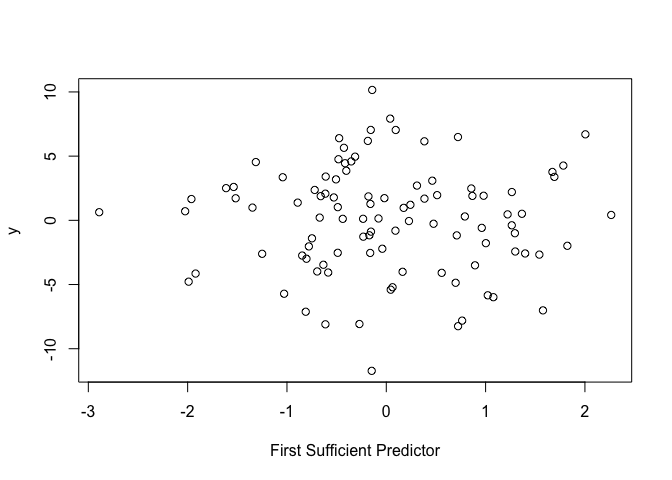

<!-- README.md is generated from README.Rmd. Please edit that file -->

\#fquantdr

<!-- badges: start -->
<!-- [](https://travis-ci.com/elianachristou/fquantdr) -->
<!-- badges: end -->

fquantdr: Dimension Reduction Techniques for Conditional Quantiles for
Functional Data
====================================================================

The R package `fquantdr` performs dimension reduction techniques for
conditional quantiles of a scalar response given the functional
predictors. Specifically, the method aims at replacing the
infinite-dimensional functional predictors with a few finite predictors
without losing important information on the conditional quantiles while
maintaining a flexible nonparametric model. For details of the
methodology, see Christou et al. (2025+).
<!-- [Christou, E., Solea, E., Wang, S., and Song, J. (2024+) Sufficient Dimension Reduction for Conditional Quantiles for Functional Data. *Journal*, volume, pages](link) -->

The main function of the package is `fcqs`, which estimates the
directions of the functional central quantile subspace. However, the
package includes more functions that are helpful to run `fcqs`.
Specifically, `mfsir` performs functional sliced inverse regression
(FSIR) of [Ferré and Yao
(2003)](https://doi.org/10.1080/0233188031000112845), `sonf` performs
scalar-on-function linear regression, and `fpca` performs functional
principal copmonent analysis (FPCA). Moreover, `fundata` generates
functional data and `mcorr` computes the multiple correlation between
two matrices.

## Installation

You can install the released version of `fquantdr` from
[CRAN](https://CRAN.R-project.org) with:

``` r
install.packages("fquantdr")
```

and then use it during any `R` session by issuing the command

``` r
library(fquantdr)
```

The development version from [GitHub](https://github.com/) can be
installed using:

``` r
install.packages("devtools")
devtools::install_github("elianachristou/fquantdr")
```

## Introducing `fcqs`

This function computes the directions that span the $\tau$th functional
central quantile subspace. These directions represent functions that can
be linearly applied via the inner product to replace the
infinite-dimensional functional predictors with a few finite predictors
without losing important information on the conditional quantiles while
maintaining a flexible nonparametric model.

The function requires several inputs:

- `x` a 3-dimensional array ($n \times nt \times p$) representing the
  functional predictors, where $n$ is the number of observations, $nt$
  is the number of time points, and $p$ is the number of predictors.
- `y` a numeric vector of length $n$ representing the scalar response.
- `tt` a numeric vector of length $nt$ representing the time points at
  which the functional data is evaluated.
- `tau` the quantile level, a numbeer strictly between 0 and 1.
- `dtau` the number of directions the user wants to extract. If not
  provided, the function will return $p$ directions.  
- `nbasis` the number of basis functions for smoothing the functional
  predictors. Currently, the only option is to use B-spline basis and
  the default value is 4.
- `norder` the order of B-splines, which is one higher than their
  degree. The default value of 4 gives cubic splines.

The function then returns:

- `ffun` the functional parameters that span the functional central
  quantile subspace ($nbasis \times d_{\tau}$ matrix).
- `betax` the resulting sufficient predictors, calculated as the inner
  product between `betacoef` and `x` ($n \times d_{\tau}$ matrix).

#### Example 1

This is a basic example that shows how to apply the function. First,
let’s define the basic parameters, such as the sample size, the number
of predictors, the vector of time points, the quantile level, and the
number of basis functions that we wish to smooth the functional
predictors.

``` r
library(fquantdr)

# define the parameters
set.seed(1234)
n <- 100
p <- 5
nt <- 100
tt <- seq(0, 1, length = nt)
tau <- 0.5
nbasis <- 4
```

Then, we need to generate the functional predictors and the scalar
response. For the functional predictors, we can use the `fundata`
function that is available in the package. An additional argument,
`eta`, is required for the function and it represents the array of
coefficients with dimensions $nbasis \times n \times p$. For the scalar
response, we use the model
$$Y = 3 \langle \beta_1, X \rangle + \epsilon,$$ where $\epsilon$ is the
error term and $\beta_1$ represent an eigenfunction. In this case, the
$\tau$-th functional central quantile subspace is generated by
$\{\beta_1\}$.

``` r
# Generate the functional predictors
library(mvtnorm)
#> Warning: package 'mvtnorm' was built under R version 4.4.1
eta.mat <- mvtnorm::rmvnorm(n, mean = rep(0, p * nbasis))
eta <- array(eta.mat, dim = c(nbasis, n, p))
data.output <- fundata(n, p, nbasis, tt, 'bspline', eta)
xc <- data.output$Xc

# Generate the scalar response
mfpca.scores <- data.output$mfpca.scores
error <- rnorm(n)
y <- 3 * mfpca.scores[, 1] + error
```

Before moving on and for illustration purposes, we plot the first
functional predictor.

``` r
matplot(tt, t(xc[, , 1]), type = "l", lty = 1, col = 1:n, xlab = "Time", ylab = "Value", main = paste("Functional Predictor", 1))
```


The purpose of the `fcqs` function is to estimate $\beta_1$ and form the
new predictor $\langle \beta_1, X \rangle$. We now run the function and
specify $d_\tau = 1$, so we can obtain the first direction.

``` r
result <- fcqs(xc, y, tt, tau, dtau = 1, nbasis)
```

The first sufficient predictor $\langle \widehat{\beta}_1, X \rangle$ is
given by

``` r
result$betax
```

Since the true relationship is
$Y = 3 \langle \beta_1, X \rangle + \epsilon$, then a plot of $Y$
against $\langle \widehat{\beta}_1, X \rangle$ should display a linear
relationship.

``` r
plot(result$betax, y, xlab = 'First Sufficient Predictor')
```



Another way to evaluate the performance of the methodology is to
calculate the correlation between the true $\langle \beta_1, X \rangle$
and the estimated $\langle \widehat{\beta}_1, X \rangle$. For that, we
can use the `mcorr` function of the package, which calculates the
multiple correlation between two matrices. The output is a number
between 0 and $d$, the dimension of the input. For this case, since we
have a one-dimensional sufficient predictor, a number closer to 1
indicates better performance.

``` r
true.pred <- mfpca.scores[, 1]
est.pred <- result$betax
mcorr(true.pred, est.pred)
#> [1] 0.03120607
```

#### Example 2

Let’s consider another example, where the $\tau$-th functional central
quantile subspace is two-dimensional. We will also modify the simulation
process to consider a different covariance structure. Let
$Y = \arctan(\pi \langle \beta_1, X \rangle) + 0.5 \sin(\pi \langle \beta_2, X \rangle / 6) + 0.1 \epsilon$.

``` r
# define the parameters
set.seed(1234)
n <- 100
p <- 5
nt <- 100
tt <- seq(0, 1, length = nt)
tau <- 0.5
nbasis <- 4

# Set the covariance matrix
SigmaCov <- matrix(0, p * nbasis, p * nbasis)
for (j in 1:p) {
index.j <-(((j - 1) * nbasis + 1):(j * nbasis))
diag(SigmaCov[index.j, index.j]) <- c(2, 1, 1/2, 1/4)
}
eta.mat <- mvtnorm::rmvnorm(n, mean = rep(0, p * nbasis), sigma = SigmaCov)
eta <- array(eta.mat, dim = c(nbasis, n, p))

# Generate the functional predictors and the scalar response
data.output <- fundata(n, p, nbasis, tt, 'bspline', eta)
xc <- data.output$Xc
mfpca.scores <- data.output$mfpca.scores
error <- rnorm(n)
y <- mfpca.scores[, 1]^3 + exp(mfpca.scores[, 2]) + error
result2 <- fcqs(xc, y, tt, tau, dtau = 2, nbasis)

# Calculate the multiple correlation
true.pred2 <- mfpca.scores[, 1:2]
est.pred2 <- result2$betax
mcorr(true.pred2, est.pred2)
#> [1] 0.5041857
```

## Applications

Potential applications of the `fcqs` function include, but are not
limited to, the following fields:

- Medical Field
- Finance
- Natural Language Processing

For example, Christou et al. (2025+) apply the methodology to an fMRI
data set that studies patients with ADHD. Specifically, the authors
investigate resting-state fMRI data from the [ADHD-200
Consortium](https://fcon_1000.projects.nitrc.org/indi/adhd200/index.html)
and determine the form of association betweent the ADHD index and the
fMRI brain activity.
